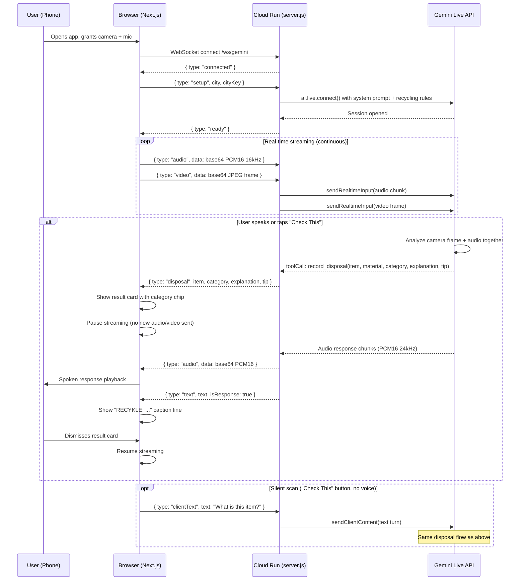
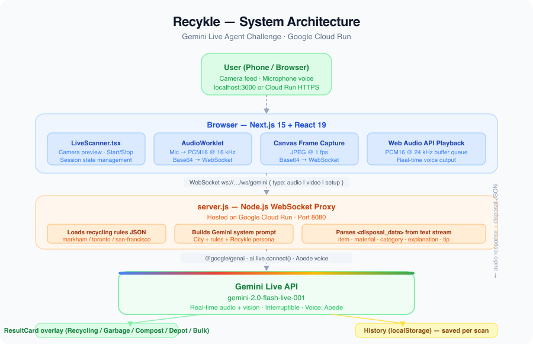

# Recykle — System Architecture

## Overview

Recykle streams live camera and microphone data from the user's phone browser to a Node.js server on Google Cloud Run, which proxies both streams simultaneously to the Gemini Live API. Gemini reasons over the combined audio and video in real time, calls a structured `record_disposal()` tool to return disposal data, then speaks a 1-2 sentence verdict back to the user.

---

## System Flow

```
User (phone camera + mic)
         |
         | Camera JPEG frames (1 fps) + PCM16 audio (16 kHz)
         v
Browser (Next.js — mobile Chrome/Safari)
  - AudioWorklet: captures mic at native rate, downsamples to 16 kHz PCM16
  - Canvas: captures camera frame, encodes as JPEG
  - Sends both as base64 chunks over WebSocket
         |
         | WebSocket  /ws/gemini
         v
Cloud Run: server.js (Node.js + ws)
  - Receives audio + video chunks from browser
  - Injects city recycling rules into system prompt at session start
  - Proxies streams to Gemini Live API via @google/genai SDK
  - Parses record_disposal() tool call response
  - Forwards audio response and disposal data back to browser
         |
         | ai.live.connect()  (v1beta1)
         v
Gemini Live API — gemini-live-2.5-flash-native-audio
  - Processes audio + video simultaneously
  - Calls record_disposal(item, material, category, explanation, tip)
  - Returns spoken audio response (PCM16 at 24 kHz)
```

---

## Sequence Diagram



---

## Component Map

| Component | File | Role |
|---|---|---|
| Screen router | `app/page.tsx` | Manages screens: setup, onboarding, scanner, notes |
| Location setup | `components/LocationSetup.tsx` | Postal code entry, city resolution |
| Onboarding | `components/Onboarding.tsx` | Permission request, tips before first scan |
| Live scanner | `components/LiveScanner.tsx` | Camera preview, mic, captions, bottom bar |
| Result card | `components/ResultCard.tsx` | Disposal result modal with category chip |
| Notes list | `components/HistoryList.tsx` | Saved depot and bulk items |
| WebSocket client | `lib/gemini-live-client.ts` | Browser-side WS wrapper, audio/video streaming |
| WebSocket server | `server.js` | Node.js proxy to Gemini Live API |
| Types | `lib/types.ts` | Shared TypeScript types, postal code resolver |
| History | `lib/history.ts` | localStorage CRUD for scan history |
| Audio worklet | `public/audio-processor.js` | PCM16 capture and downsampling |
| Recycling rules | `lib/recycling-rules/*.json` | City-specific disposal rules (Markham, Toronto, SF) |

---

## Data Flow: Disposal Detection

Recykle uses **Gemini function calling** (not text parsing) for reliable structured output:

1. Session config includes a `record_disposal` tool declaration
2. When Gemini identifies an item, it calls `record_disposal(item, material, category, explanation, tip)` as a `toolCall` message
3. Server intercepts this message, sets `disposalFiredThisTurn = true`, and forwards the structured data to the browser as `{ type: "disposal", ... }`
4. Server sends `sendToolResponse()` back to Gemini to acknowledge the call
5. Gemini then speaks its 1-2 sentence verdict
6. All text arriving after the tool call is tagged `isResponse: true` and shown in the caption as "RECYKLE: ..."

This approach is more reliable than XML parsing because `toolCall` messages arrive as a separate structured channel, independent of the audio transcription stream.

---

## Deployment

Hosted on **Google Cloud Run** (managed, serverless containers).

```
gcloud run deploy recykle-app \
  --image REGION-docker.pkg.dev/PROJECT/recykle/recykle-app \
  --set-env-vars GEMINI_API_KEY=...,GEMINI_MODEL=gemini-live-2.5-flash-native-audio \
  --memory 512Mi --cpu 1 --min-instances 0 --max-instances 10
```

See `deploy.sh` for the full one-command deployment script.

---

## Architecture Diagram



> To regenerate this image: paste the Mermaid sequence diagram above into [mermaid.live](https://mermaid.live), export as PNG, and replace `architecture.png` in the repo root.
